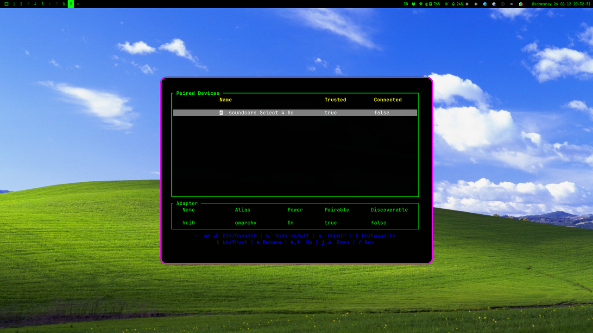

# Bliss 95

An Omarchy theme inspired by early computer aesthetics: black background with pure RGB colors.

## Palette

| Role | Color |
|------|-------|
| Background | `#000000` |
| Foreground | `#00FF00` |
| Accent | `#FF00FF` |
| Cursor | `#00FF00` |

Full 16-color ANSI palette in `colors.toml`.

## Install

Via the Omarchy menu: `Install > Style > Theme` (`Super + Alt + Space`) and paste this repo URL:

```
https://github.com/rubenxyz/omarchy-bliss95-theme
```

Or from the terminal:

```
omarchy theme install https://github.com/rubenxyz/omarchy-bliss95-theme
```

## Screenshot



## Credits

- Wallpaper: [Bliss](https://en.wikipedia.org/wiki/Bliss_(image)) (600dpi scan)
- Icon set: Yaru-blue
- Neovim colorscheme: [hackerman.nvim](https://github.com/bjarneo/hackerman.nvim)
